# Migrate for Compute Engine (EC2 to GCE) using Terraform

This paper documents the migration of a simple web server application running on EC2 instance of Amazon Web Services to a GCE instance on Google Cloud Platform using Migrate for Compute Engine and Terrraform modules.

The process is done following the combination of official [documentation](https://cloud.google.com/migrate/compute-engine/docs/4.11/how-to/migrate-aws-to-gcp/overview) and the GCP partner [training](https://partner.cloudskillsboost.google/focuses/20537?catalog_rank=%7B%22rank%22%3A2%2C%22num_filters%22%3A0%2C%22has_search%22%3Atrue%7D&parent=catalog&search_id=16681751) materials including automated scripts to create migration service accounts, allocating necessary roles, configure authentication token and terraform variable files etc.

For this migration trial, Nordcloud’s GCP and AWS sandbox accounts were used which meant the organizational policies and restrictions were in place. Some codes have been changed and some work-around implemented due to aforementioned restrictions. 

The migration process can be divided into major steps: 

1. Making both GCP and AWS projects ready
2. Creating appropriate VPC in both platforms
3. Creating a VPN between the AWS and GCP VPCs for the migration
4. Installing the Migrate for Compute Engine drivers into the source EC2 instance
5. Setting up Migration Service Accounts
6. Setting up the Migration Manager
7. Configuring AWS as source
8. Generating Migration Waves
9. Testing the migrated GCE instance


The steps are gone through sequentially in the following section with description and help when deemed necessary.

 The process can be started with Google Cloud Shell. Set your project id and desired region/zone and other configuration.  \
It’s good to begin by copying the folder with required Terraform files and other scripts to automate some of the configurations:  \
You can also use this repo instead and not copy the files from Google and skip the next step and move to AWS console step instead.  \


```
gsutil cp gs://cloud-training/OCBL213/autonetdeploy-multicloudvpn2.tar .
tar xvf autonetdeploy-multicloudvpn2.tar
cd autonetdeploy-multicloudvpn2.tar
```


This code copies the folder, extracts and changes into the required directory.

Through the AWS console, you can create a service account with appropriate permissions to create an access credentials for programmatic access. For the demo, User with Admin access was created. This can be done under IAM section of AWS.

Services > IAM > Users > Add User

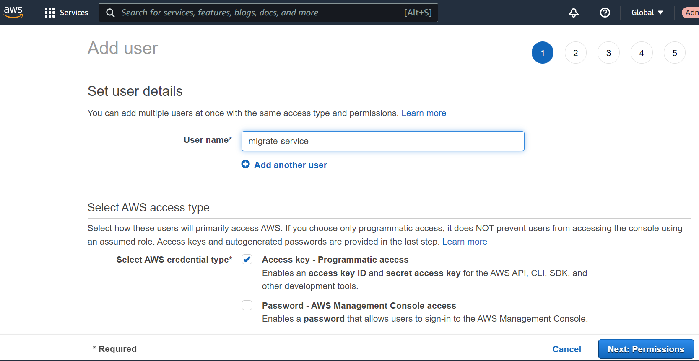
 

After creation, the access key pair can be copied and downloaded for future use.

Export the access key pair in your cloud shell instance:

 \
`export AWS_ACCESS_KEY=[YOUR_ACCESS_KEY] \
export AWS_SECRET_KEY=[YOUR_SECRET_KEY]`

Then you can run the script file to create AWS credential file: 


```
./aws_set_credentials.sh $AWS_ACCESS_KEY $AWS_SECRET_KEY
```


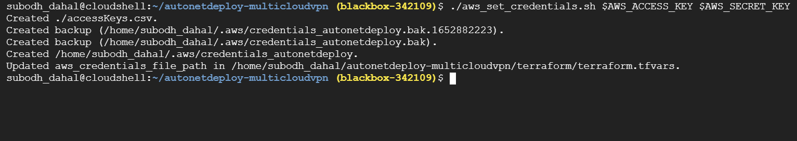


The script creates credentials and terraform.tfvars file. 

The created terraform.tfvars file can be inspected and required value can be added:  `gcp_project_id = "YOUR_GCP_PROJECT_ID"`

This completes the terraform config as required for the purposes of this demo migration. 

Now to create a ssh keypair to be used in AWS EC2 instance. The following code will create a new keypair, restrict access to your private key and registers your public key with the Google Cloud.


```
ssh-keygen -t rsa -f ~/.ssh/vm-ssh-key -C $(whoami)
chmod 400 ~/.ssh/vm-ssh-key
gcloud compute config-ssh --ssh-key-file=~/.ssh/vm-ssh-key
```


Now you can download the key file. Get the key file path from the code and then download from the given path. 


```
readlink -f ~/.ssh/vm-ssh-key.pub
```


Now you need to import the key file to your AWS console through All Services > EC2 > Resources > Key pairs > Actions > Import Key Pair


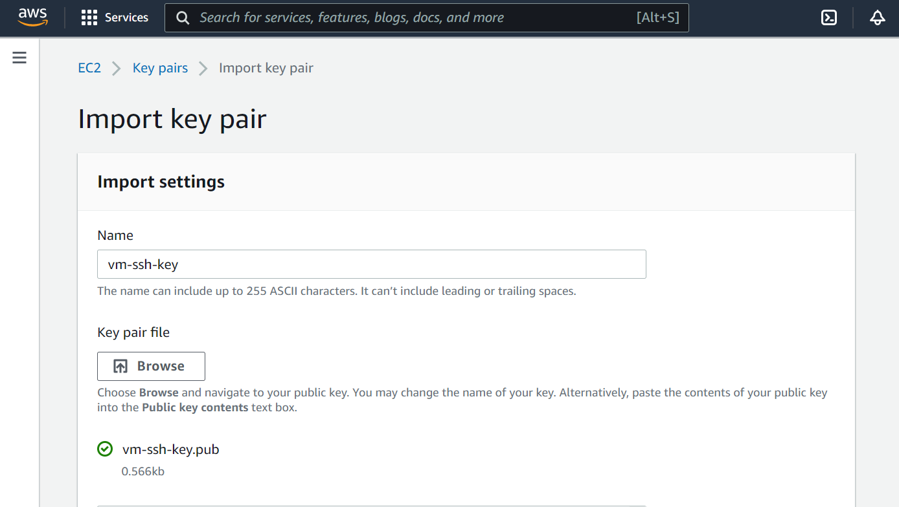


Now time to initialize, validate and deploy the resources using terraform. 

Goto the directory with terraform files. 


```
cd terraform
```


The provider versions can be deleted from the main.tf files to get rid of warnings. 

Since we are not using credentials files for GCP, the `credentials` field in main.tf should be removed.  \
Remember to remove the variable `gcp_credentials_file_path` from gcp_varaibles.tf too. Final version of the main.tf file can look like this: 

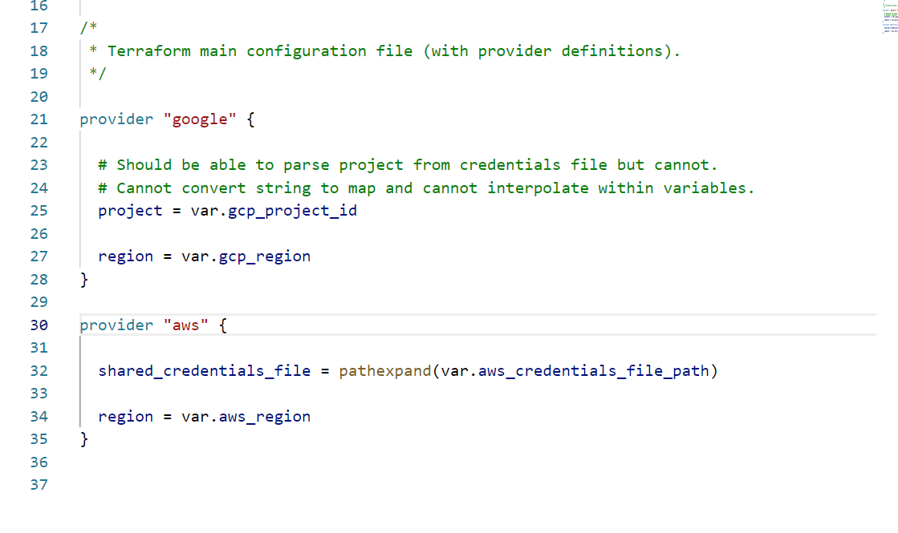


Initialize and validate the terraform configuration.  \

```
terraform init
terraform validate
terraform plan
```

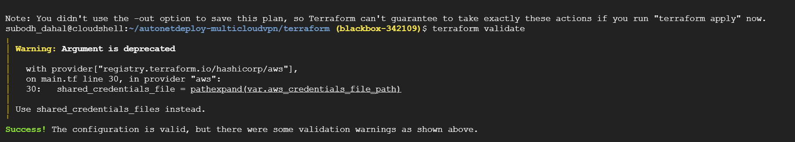


Then you can apply it with : \
`terraform apply -auto-approve`

The creation of all the infrastructure takes some time. Wait until it says it is complete: 


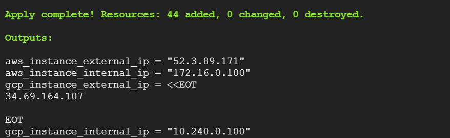


The resources are deployed now. With this, processes until step 3 are done. 

**Installing the Driver into the EC2 Instance**

SSH into the EC2 instance through Google Cloud Shell


```
ssh -i ~/.ssh/vm-ssh-key ubuntu@[AWS_INSTANCE_EXTERNAL_IP]
```


When the ssh connection is established, install apache2 web server application


```
sudo apt update && sudo apt -y install apache2
```


Lets add a custom message while we’re at it


```
echo "I do hope to be migrated safely" > MyText.txt
```


This should install the required application. \
Install the Migrate for Compute Engine drivers into the source EC2 instance.


```
wget https://storage.googleapis.com/velostrata-release/4.5/4.5.1/velostrata-prep-0.9-3.deb
sudo dpkg -i velostrata-prep-0.9-3.deb
sudo apt-get update && sudo apt-get install -f -y
exit
```


The EC2 instance is ready.

**To set up the Migration Service Accounts**, we can run the given script which simply creates the required migration service accounts and gives them required roles for the operation. You can inspect the given script which is not very exciting. 


```
cd autonetdeploy-multicloudvpn/
sh migrate_sa_roles.sh
```


**To Setup the Migration Manager,** goto GCP console and search for Migration for Compute Engine in Marketplace.


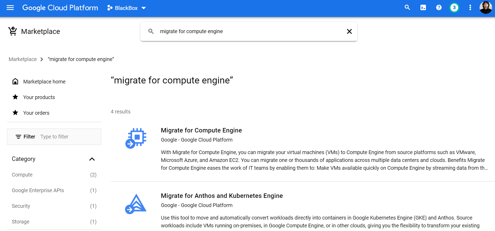


Then launch the Migrate for Compute Engine. Since we have deployed all the necessary resources with Terraform we can safely create a migration manager by checking box that says all the requirements have been fulfilled.


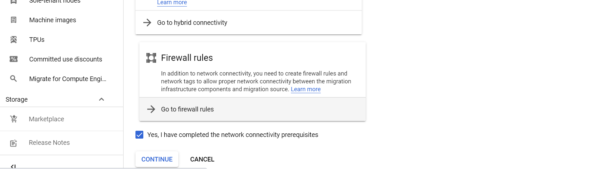


In the creation wizard, fill the name and make sure the region and zone are same as your GCP network and subnet. 

Use following details as per your deployed resources in relevant fields which are fairly self-explanatory. 

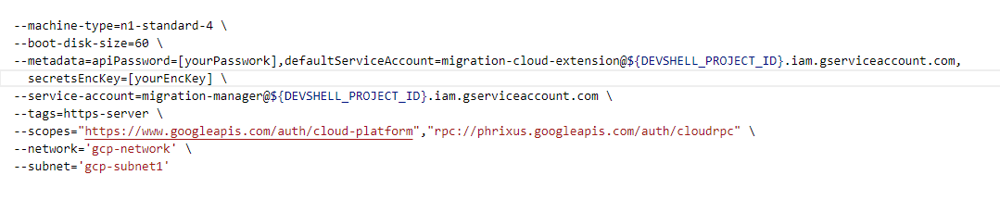


It should look as follows:


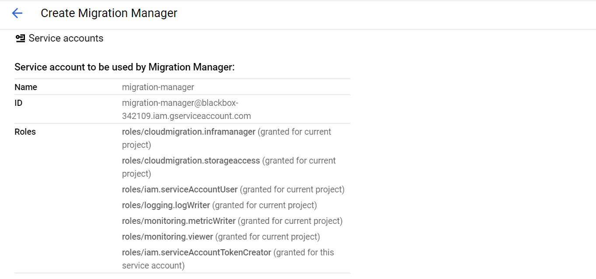
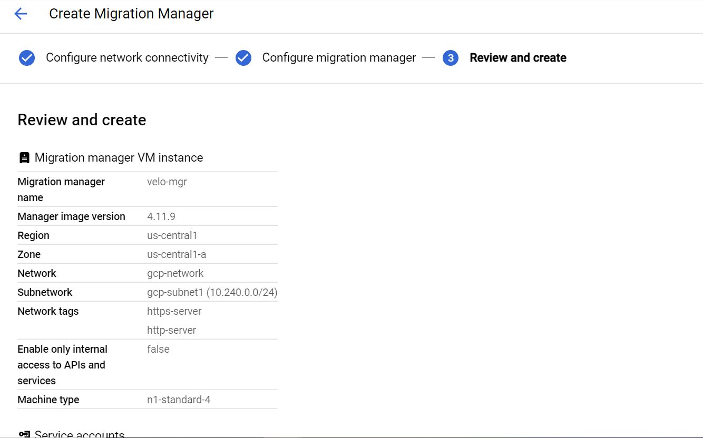


This should create a GCE instance to act as a Migration Manager visible on your Compute Engine Instances. Goto the External IP address of the Migration Manager. If prompted by a security check, proceed to the site and enter the credentials used during the creation of migration manager.


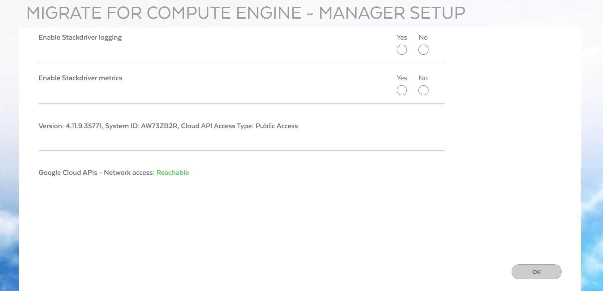


Both options can be chosen but are optional. 

Next screen is the home screen for main migrations. 


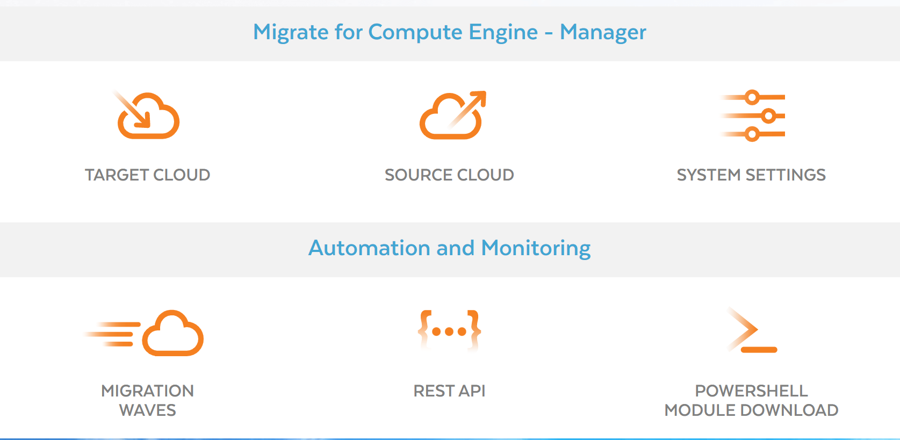


**Configure AWS as the Source Cloud**

 \
Source Cloud > Cloud Credentials > Create and specify the needed details. 


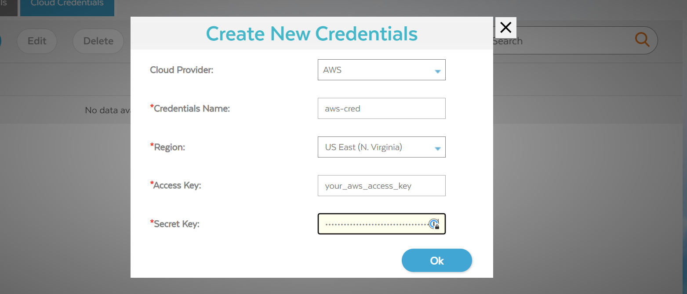


Then goto Cloud Details tab and click Create

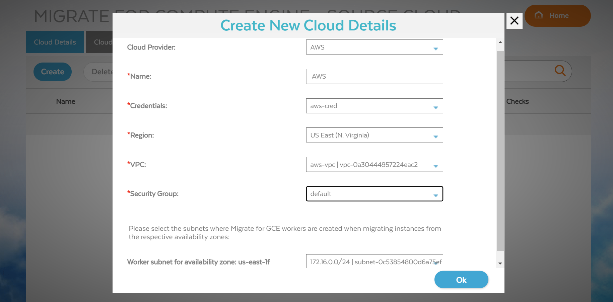


Fill the relevant information carefully.  \
 \
Then to **set up cloud extensions from Target Cloud**.  \
Target Cloud > Cloud Extensions > Create

Enter Project, Region and VPC, Destination according to your GCP project setups with help of dropdown menu. 

In Default Service Account for Workloads enter migration-cloud-extension 

In the Cloud Extension Tab:  \

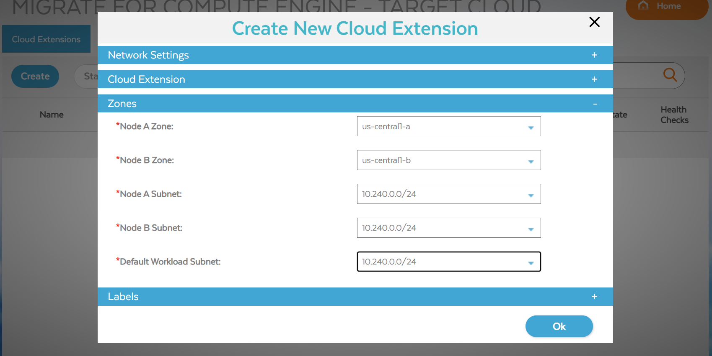


In the Zones tab:

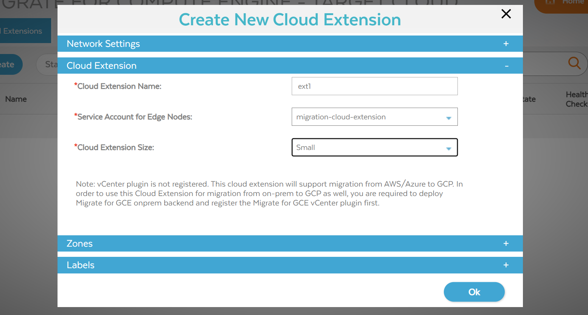


Wait until your extension is on active status to proceed to **Create Migration Waves** \
Click on Home > Migration Waves > Generate Runbooks

Fill in the details as shown and click create and wait for a file to be downloaded.  \

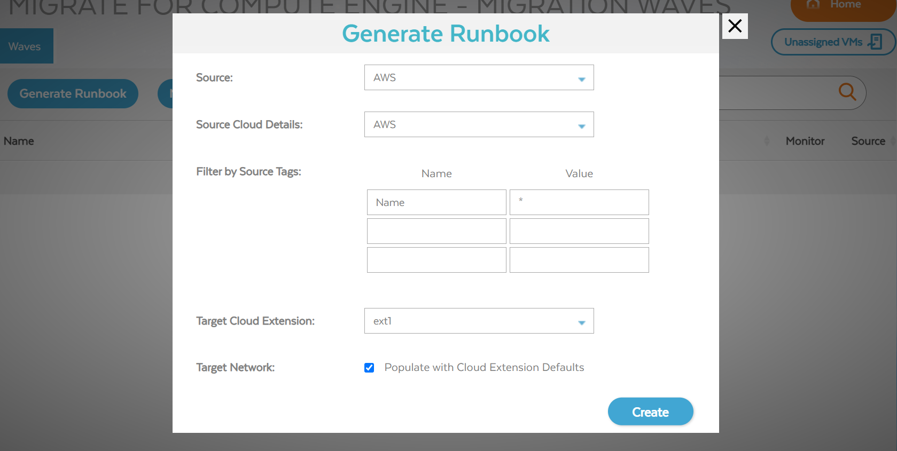


Import the file in Google Sheets with Comma Separated setting as follows:  \
 \

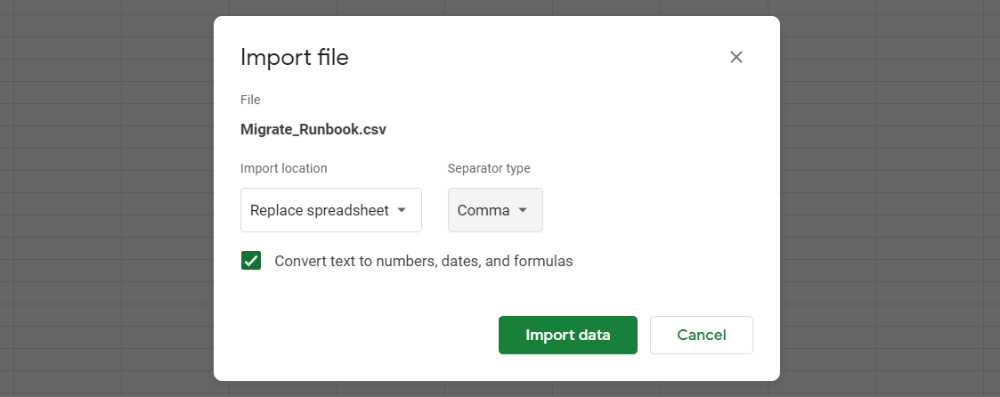


Change the RunGroup column value to 1 from -1 and \
Change the TargetInstanceType to n1-standard-1  \
Download the file in csv format

Good FINALLY, time to create wave of migrations. 

Click Migration Waves > New Wave  \
Then name your migration wave and import your modified csv file. 


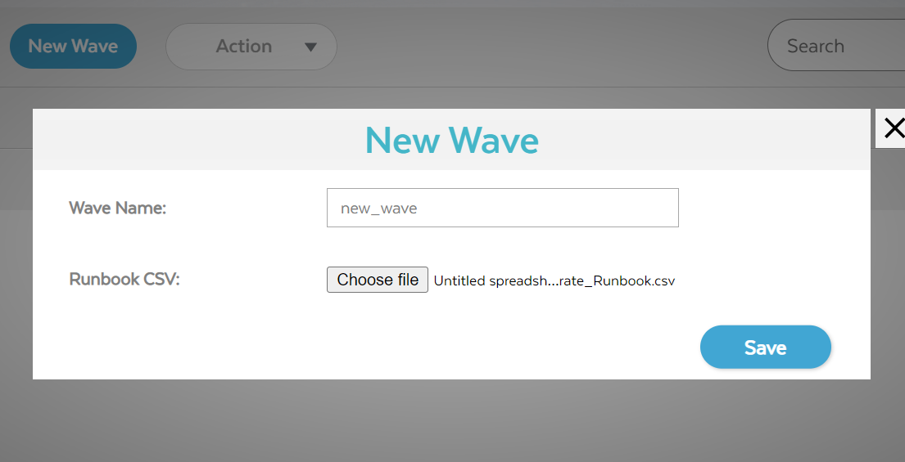


Click your newly created wave > Action > Validate > Yes

Once the status is passed

Click your newly created wave > Action > New Job > Full Migration > Start

**Congrats! Your migration has started: **


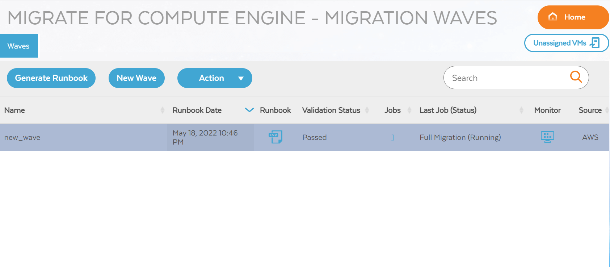


You can click Monitor to see the process and wait for it to be completed with “Ready to Detach”.  \
Meanwhile you will see that the Instance in AWS will be stopped and there will be a new instance in GCP compute engine instances list. Once it is ready, it is time to check our migrated GCE instance. 

To **check the migrated GCE instance properly,** we need to first make it accessible with external IP. Goto the Compute Engine Instance and Edit the newly created instance. Under Network Interface > Your VPC Network > External IP > Ephemeral > Done.  \
It will expose your instance to the internet. Then Click on Save


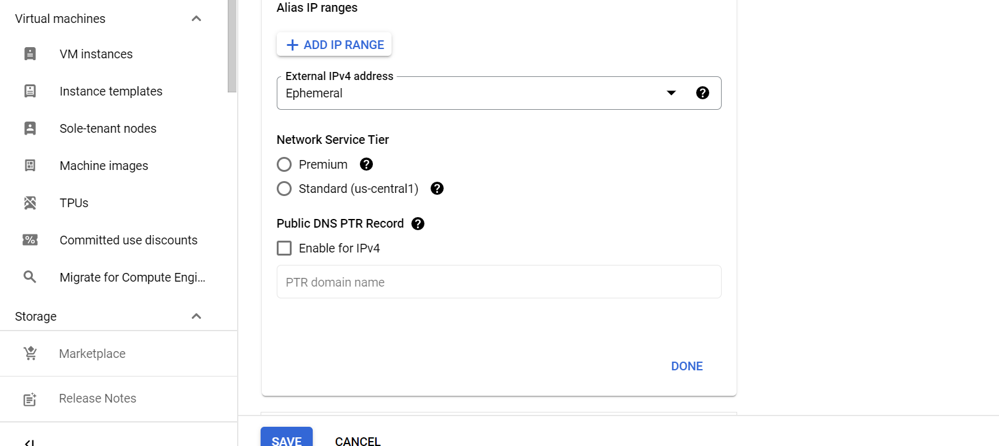


Now you can test your migrated instance by making an SSH connection to it. 


```
ssh -i ~/.ssh/vm-ssh-key ubuntu@[PUBLIC_IP]
ls
```


Check the MyText.txt file you created in the AWS instance. \


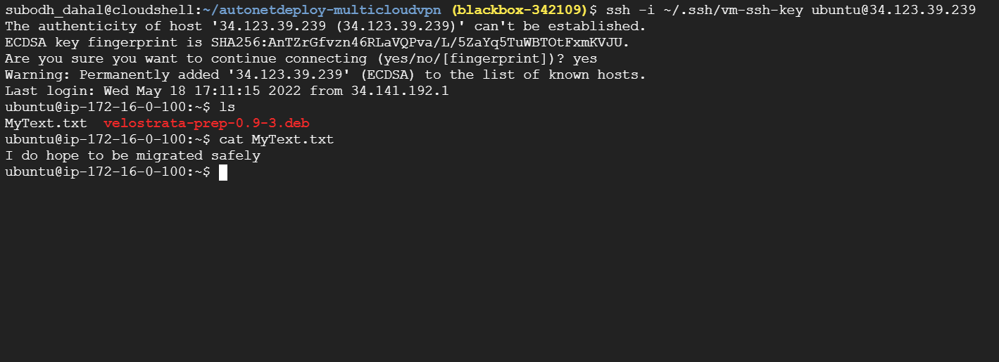

And it looks as beautiful as I remember it to be :D  
